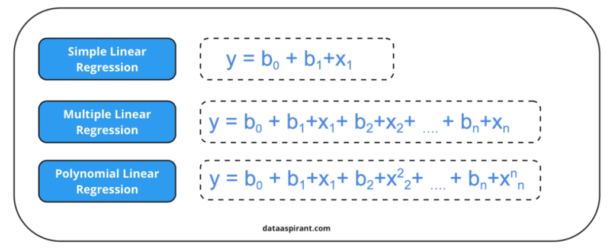
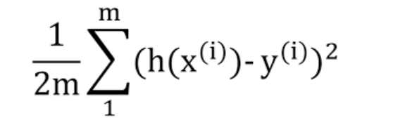

# Linear Regression Algorithm from Scratch

## Defination
Linear Regression is a supervised learning algorithm used for predicting continuous values. It establishes a linear relationship between the input features (independent variables) and the target variable (dependent variable). The algorithm aims to find the best-fitting line that minimizes the error between predicted and actual values.

Linear Regression is widely used in statistics and machine learning for regression tasks. It predicts continuous outcomes by modeling the relationship between variables using a linear equation.

## Types of Linear Regression :
1. Simple Linear Regression: Uses only one independent variable to predict the dependent variable. 
2. Multiple Linear Regression: Uses multiple independent variables to predict the dependent variable. 

## Mathematical Foundation :
### Linear line equation :
The line that best represents the relationship between the variables.Below is the equation  

**Y = mX + c** ... for simple linear regression

**Y = w1X1 + w2X2 + ...wnXn + b** ... for multiple linear regression

or 

Where,
    Y = Target Feature (Dependent Variable)

    X = Input Feature (Independent Variable) 
    
    m, w1,w2,..wn, theta1 theta2 = Coefficients (Weights)
    
    c,b,theta0 = Intercepts (Bias)

The goal of Linear Regression is to find the best values for **m** (or w) and **c** such that the difference between actual and predicted values is minimized.

### Cost Function (Mean Squared Error - MSE)
A measure of how well the model fits the data, often using Mean Squared Error (MSE).

### Gradient Descent Algorithm
An optimization algorithm used to find the best parameters (coefficients) for the regression line. 

## How it works: 
The algorithm finds the "line of best fit" that minimizes the difference between the predicted and actual values of the dependent variable. 

1. Initialize model parameters (θ) randomly or with zeros.
2. Compute the predicted values using the hypothesis function.
3. Calculate the error (difference between predicted and actual values).
4. Update the model parameters using gradient descent.
5. Repeat steps 2–4 until convergence (minimal cost).

### Real world application :
   * Stock Price Prediction
   * Sales Forecasting
   * Predicting house prices based on factors like size and location
   * Analyzing the Relationship Between Advertising Spend and Sales
    

Independent Variable (X): The variable used to predict the dependent variable. 
Dependent Variable (Y): The variable being predicted. 

Regularization: Techniques (like Lasso and Ridge regression) that help prevent overfitting by adding a penalty term to the cost function.
